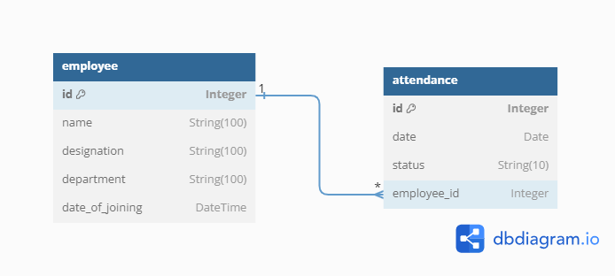
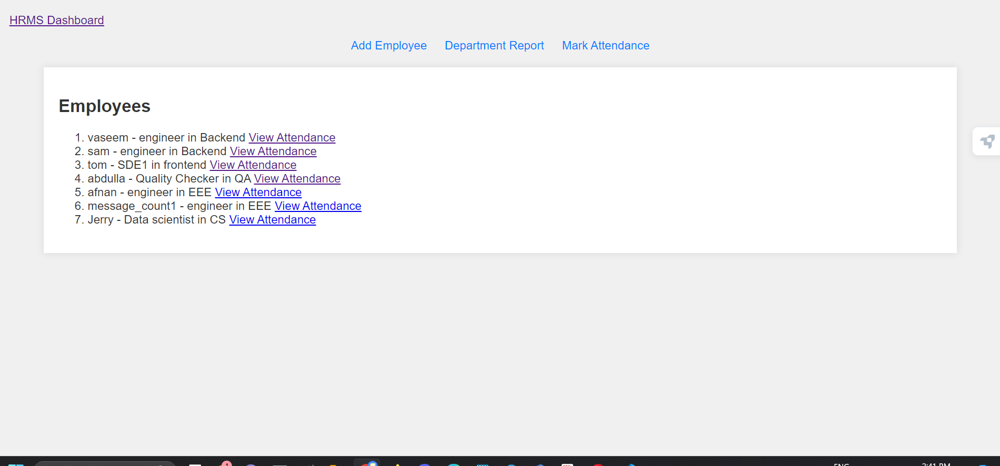
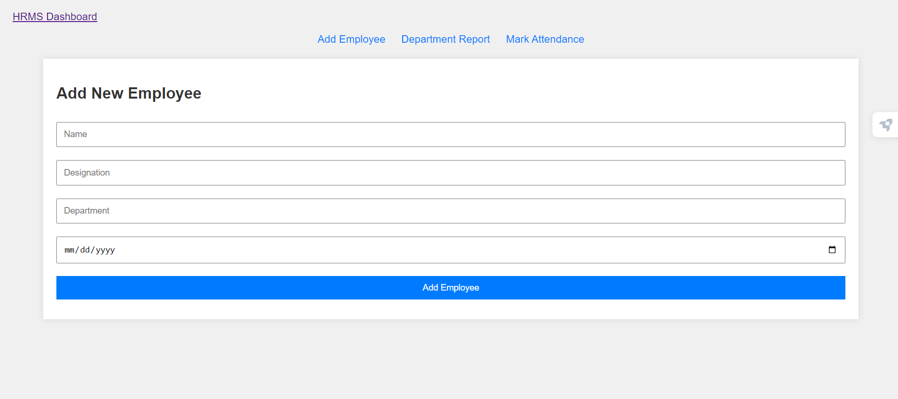
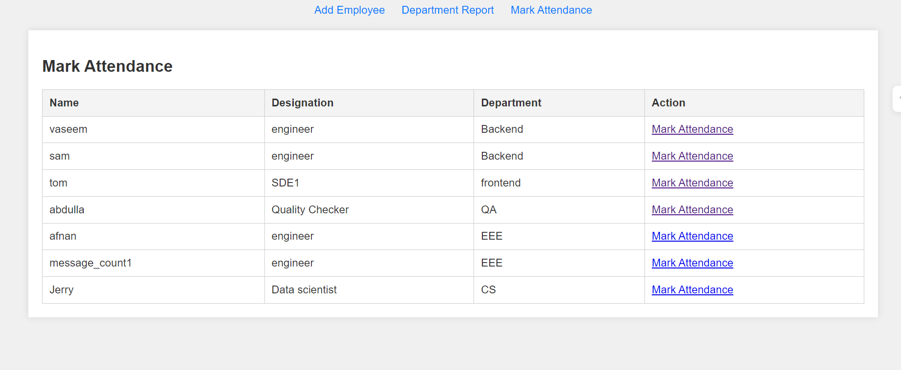
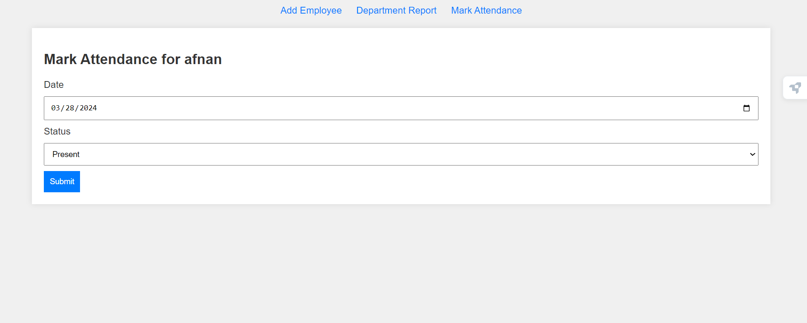
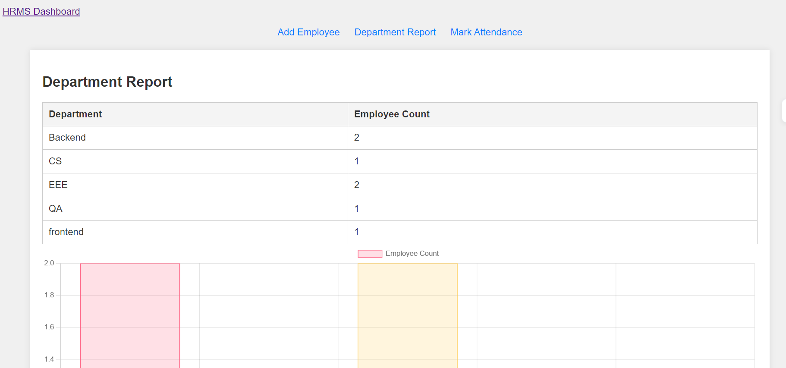

# hrms-management-App

This hrms management application is designed to manage employee information in a company for hr managers, which can adding new employees, retrieving their informations and marking their attendance. This application is developed with flask, a lite use web-app framework availabe in python and uses sqlite for managing the database.

##  Description

This hrms app is designed with pythom famework flask, which helps the hr managers in an organization to do their company's employee managment by adding new employees to the database, tracking their daily attendance and retrieving department-wise employee details, etc.

### Features

- **Employee Management**: Add and view employee details.
- **Attendance Tracking**: Mark daily attendance for each employees.
- **Department Report**: Generate reports showing the number of employees in each department, with table and bar chart.

## Project structure

This is the basic overview of the project structure:


### instance/
- hrms.db # SQLite database file

### static/ # Static files directory
- styles.css # CSS file for styling the application

### templates/ # Templates directory for Jinja2 HTML templates
 - add_employee.html # Template for adding a new employee
 - base.html # Base template for inheriting common structures
 - department_report.html# Template for departmental report and charts
 - employee_attendance.html # Template for employee attendance details
 - employee_list.html # Template for listing employees
 - home.html # Template for the homepage
 - mark_attendance.html # Template for marking employee attendance
### main files
- venv/ # Virtual environment directory for project dependencies
- requirements.txt # Lists all Python dependencies for the project
- .gitignore # Specifies intentionally untracked files to ignore
- app.py # Main application file with Flask routes and all functions
- models.py # Defining the db models
- view_db.py # script to view contents of the database

## API Endpoints and Routes

- `GET /`: The home page which lists all employees.

- `GET /employee/add`: Displays a form to add a new employee.

- `POST /employee/add`: Submits the form data to add a new employee to the database.
  - Request body contains employee details such as `name`, `designation`, `department`, etc.

- `GET /employee/list`: Lists all employees with their details.
 - `GET /attendance/mark/<employee_id>`: Displays a form to mark attendance for that employee.

- `POST /attendance/mark/<employee_id>`: Submits attendance data for the specified employee.
  - URL parameter: `employee_id` (integer) — The ID of the employee for whom attendance is being marked.
  - 
- `GET employee/<employee_id>/attendance`: Displays a attendance of specific employee.

- `GET /department-report`: Shows a report with the count of employees in each department.
  
## Database schema

The database consists of two main tables: Employee and Attendance. 

## Tables

*Employee*
| Column           | Type        | Description                                      |
|------------------|-------------|--------------------------------------------------|
| `id`             | Integer     | A unique identifier for each employee. Primary key. |
| `name`           | String(100) | The name of the employee.                        |
| `designation`    | String(100) | The job designation of the employee.             |
| `department`     | String(100) | The department where the employee works.         |
| `date_of_joining`| DateTime    | The date when the employee joined the company.   |


*Attendance*
| Column           | Type        | Description                                      |
|------------------|-------------|--------------------------------------------------|
| `id`             | Integer     | A unique identifier for each employee. Primary key. |
| `date`           | Date        | The name of the employee.                        |
| `status     `    | String(100) | The status ('present or absent').                |
| `employee_id`    | Integer     | The foreign key linked to id of employee table.  |



## Installation

1. **Clone the Repository**

    ```
    git clone https://yourrepositorylink.git
    cd hrms-flask-app
    ```

2. **Create and Activate a Virtual Environment**

    ```
    python -m venv venv
    venv\Scripts\activate
    ```

3. **Install Packages**

    ```
    pip install -r requirements.txt
    ```

4. **Initialize the Database**

    ```
    flask db init
    flask db migrate -m "Initial migration."
    flask db upgrade
    ```

5. **Run the Application**

    ```
    flask run
    ```

## Additional Informations

Welcome to the HRMS Flask application project! As an intern, you will contribute to developing and maintaining a web application that is critical for managing our company's human resources efficiently. I have used basic flask methods and functions to build all the routes and endpoints required for the functioning of app. SQLAlchemy is used for ORM with flask. Jinja engine is used to render html templates.






